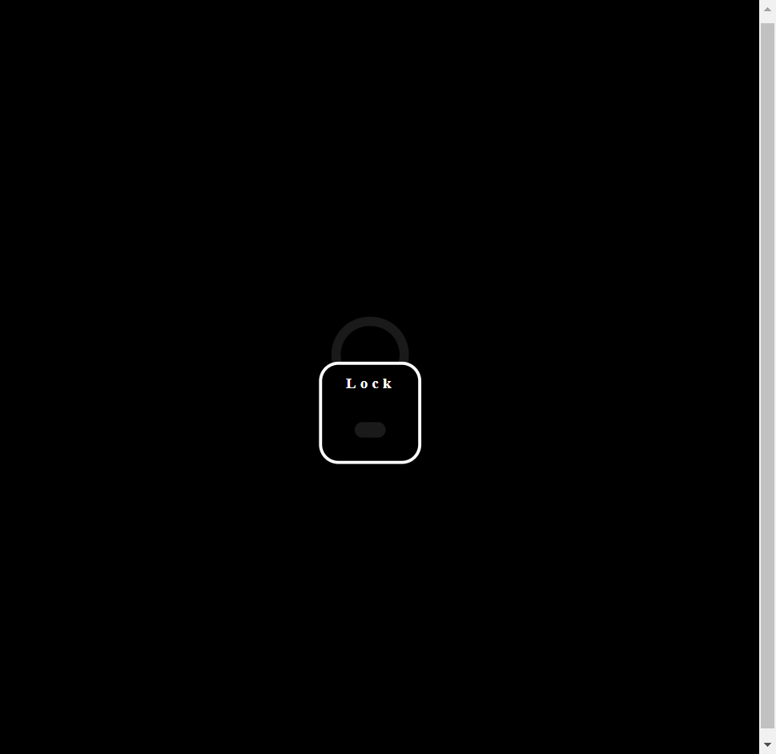
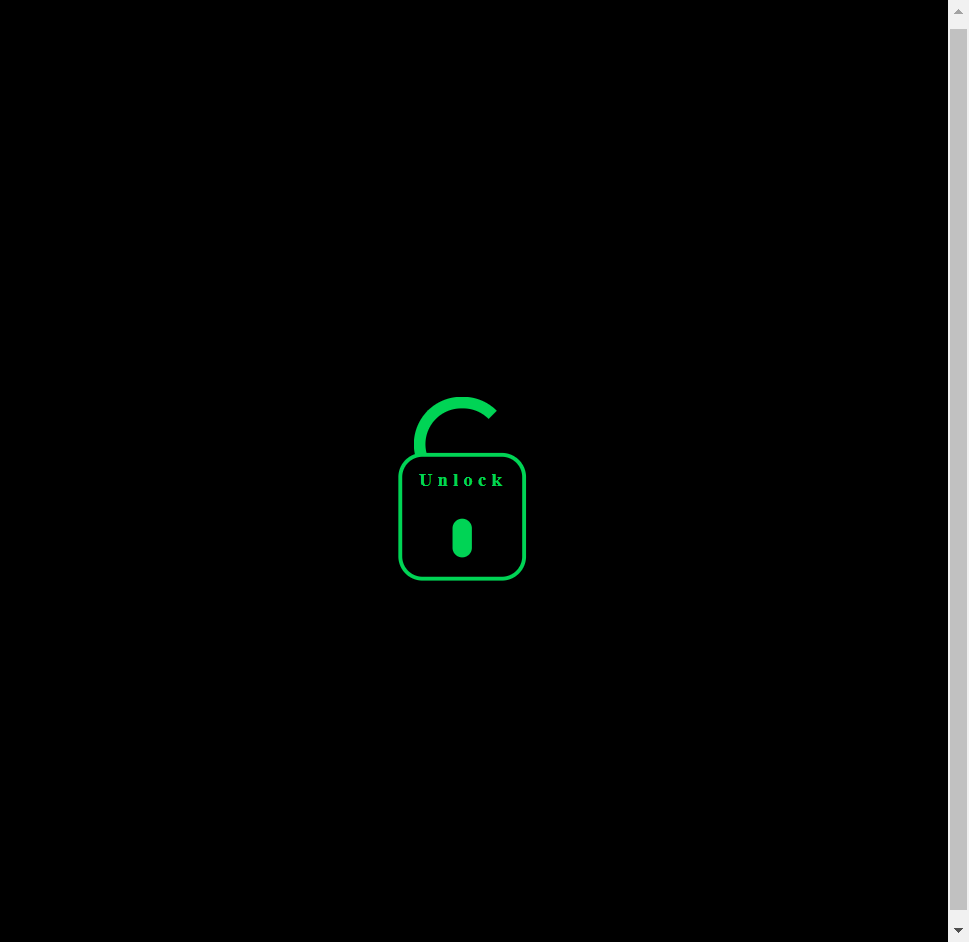

<h1 align='center'>Lock-Animation</h1>

A lock/unlock effect for your apps. This animation was made using HTML, CSS and JAVASCRIPT. I hope you enjoy it!

## Features Developed

- [x] DOM element manipulation
- [x] Animation when clicking 

## Screenshots

 

## Technologies

## Services Used

</a>

## Deploy

You can access the project by clicking the button below.

